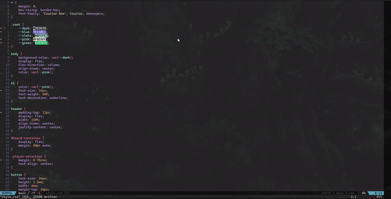

# convert.nvim

## Dependencies
- [nui.nvim](https://github.com/MunifTanjim/nui.nvim): UI Components

## Features
- Convert css units with one simple command
- track base font size on save to convert px to rems accurately (Single file support only)

## Installation: 
Use your favourite plugin manager

- Lazy: 
```lua
return {
  'cjodo/convert.nvim',
  dependencies = {
    'MunifTanjim/nui.nvim'
  },
  keys = {
    { "<leader>cn", "<cmd>ConvertFindNext<CR>", desc = "Find next convertable unit" },
    { "<leader>cc", "<cmd>ConvertFindCurrent<CR>", desc = "Find convertable unit in current line" },
    { "<leader>ca", "<cmd>ConvertAll<CR>", desc = "Convert all of a specified unit" },
  },
}
```

## Usage
You can choose you're own custom keys for the ui menu
```lua
  config = function()
    local convert = require('convert')
    -- defaults
    convert.setup({
      keymaps = {
        focus_next = { "j", "<Down>", "<Tab>" },
        focus_prev = { "k", "<Up>", "<S-Tab>" },
        close = { "<Esc>", "<C-c>", 'qq' },
        submit = { "<CR>", "<Space>" },
      }
    })
  end

```


- There are only two commands, ```:ConvertFindCurrent``` & ```:ConvertFindNext```
- Convert find next will look for the next convertable unit in the file
- Convert find current will look for a unit on the current line
